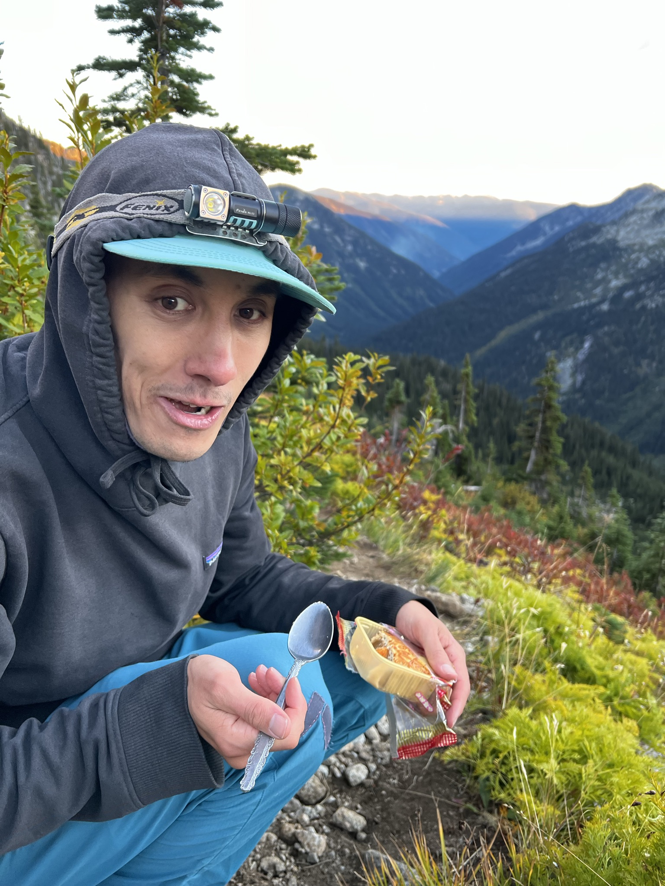

```{r setup, include=FALSE}
knitr::opts_chunk$set(echo = TRUE)
```

&nbsp;

Hi! I am an ecologist working at the interface of natural history, data science, and biodiversity policy. 

I am currently studying the impacts of resource industries on bird populations as a postdoc with the [Boreal Avian Modelling Project](http://borealbirds.ca). 

&nbsp;
&nbsp;
&nbsp;

<p align="center">
{width=40%}\
[Mooncakes](https://en.wikipedia.org/wiki/Mooncake) are a fantastic snack on the trail. 