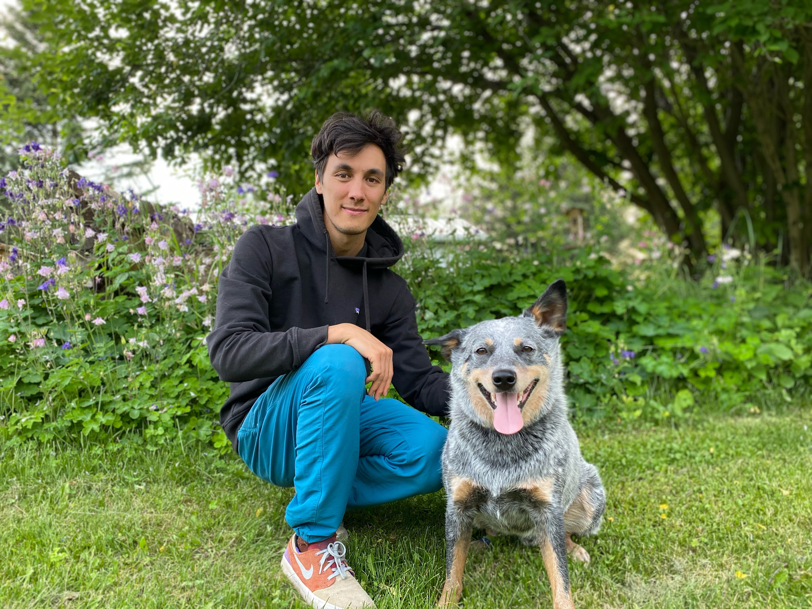

```{r setup, include=FALSE}
knitr::opts_chunk$set(echo = TRUE)
```

&nbsp;

Hi! I am a PhD Candidate supervised by [Quentin Cronk](http://cronklab.wikidot.com/) and [Jill Jankowski](https://www.zoology.ubc.ca/~jankowsk/) at the Biodiversity Research Centre, University of British Columbia. I am interested in coevolution as a driver of morphological, ecological, and genetic diversity in plants and hummingbirds.

&nbsp;
&nbsp;
&nbsp;

いらっしゃいませ！私は、UBCの生物多様性研究センターで [Quentin Cronk](http://cronklab.wikidot.com/) と[Jill Jankowski](https://www.zoology.ubc.ca/~jankowsk/)によって監督されている博士課程の候補者です。私は、植物やハチドリの形態的、生態学的、遺伝的多様性の推進力としての共進化に興味を持っています。

&nbsp;
&nbsp;
&nbsp;

<p align="center">
{width=40%}\
This is Lupin; he is a bloodthirsty [Queensland Heeler](https://en.wikipedia.org/wiki/Australian_Cattle_Dog#In_the_United_States)